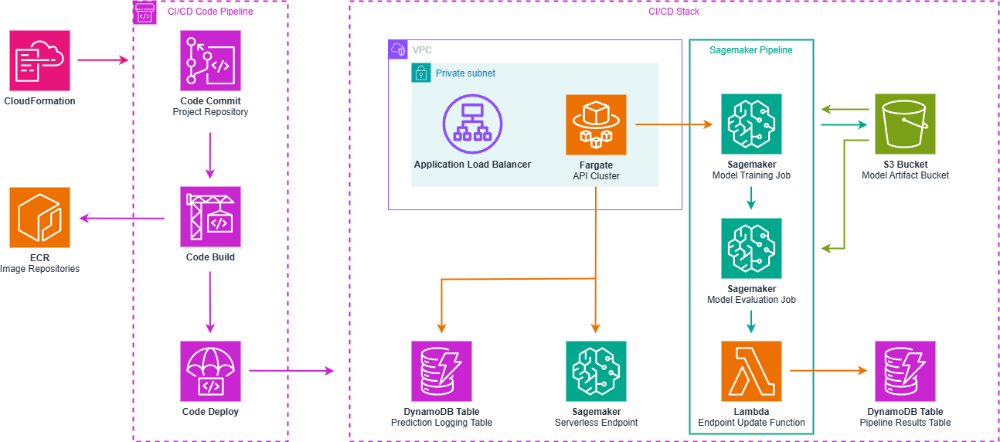

# Architecture

The project architecture is implemented inside AWS. It uses an ECS Fargate cluster fronted by an Application Load Balancer (ALB) to implement an API for the training and inference of a property price prediction model. The training of the model is performed inside a pre-configured Sagemaker Pipeline and the inferences are done by accessing a SageMaker Serverless endpoint updated automatically every time a new model that passes minimum quality checks is trained. The architecture is run inside a private VPC, so to test the API we use an AWS Lambda function that uses the python library "requests" to send HTTP requests to the load balancer. All inferences are also logged inside a DynamoDB table for future analysis and all execution logs are sent to CloudWatch. Below is an image of the architecture.



# Setup de Arquitetura

## Pré-requisitos

- O usuário deve possuir acesso a uma conta da AWS com privilégios de administrador.
- Todos os recursos devem ser criados na zona `us-east-1` (North Virginia).
- O usuário deve ter o repositório de código do Github clonado para a máquina atual dele.

## 1- Criar Pipeline de CI/CD

1. Entre na sua conta AWS
2. Busque pelo serviço CloudFormation na janela de busca
3. Clique em "Create stack" e em seguida "with new resources (standard)"
4. Na primeira tela clique em "Choose an existing template" e "Upload a template file"
5. Clique em "Choose file" e selecione o arquivo `aws_cloudformation/pipeline_stack.yml` do repositório do projeto
6. Avance para a próxima página
7. Escolha um nome para a stack do CloudFormation a ser criada. Optou-se no exemplo por `bain-ml-engineering-test-prd`
8. Escolha um nome para o projeto do Sagemaker a ser criado com o pipeline. Optou-se no exemplo por `BainMLEngineeringTestPrd`
9. Escolha um Stage para o stack. Recomenda-se `prd`, visto que isso afeta o nome dos recursos e foi o escolhido na elaboração da solução.
10. Prossiga até a última tela do processo
11. Preencha a caixa dizendo "I acknowledge that AWS CloudFormation might create IAM resources."
12. Clique em "Submit"
13. Aguarde até a criação do pipeline ser finalizada

## 2- Enviar o repositório para o CodeCommit

1. Crie as chaves para a conexão HTTPS com o CodeCommit (para mais detalhes acessar o link [AWS CodeCommit HTTPS setup](https://docs.aws.amazon.com/codecommit/latest/userguide/setting-up-gc.html?icmpid=docs_acc_console_connect_np))
    1. Buscar o serviço IAM na aba de busca da AWS
    2. Clique em "Users" e clique no usuário a ser utilizado para fazer a conexão com o CodeCommit
        - Caso você não possua um usuário, siga as seguintes instruções:
            1. Na tela de "Users" clique em "Create user"
            2. Escolha um nome para seu usuário. No projeto escolhemos "price-predictor-adm"
            3. Clique em "Next"
            4. Clique em "Attach policies directly" e selecione a policy "AdministratorAccess"
            5. Clique em "Next"
            6. Clique em "Create user"
    3. Clicar em "Security credential" e descer até "HTTPS Git credentials for AWS CodeCommit"
    4. Clique em "Generate credentials"
    5. Salvar o nome de usuário e senha fornecidos localmente
    6. Buscar o serviço CodeCommit na aba de busca da AWS
    7. Ir até o CodeCommit, selecionar o repositório criado (no exemplo, `sagemaker-BainMLEngineeringTestPrd-modelbuild`) e clicar em "Clonar URL" seguido de "Clonar HTTPS"
    8. Ir até o repositório local e executar os seguintes comandos:
        ```sh
        git remote add codecommit <URL Clonada>
        git push codecommit main:prd
        ```
    9. Inserir o usuário e senha gerados para a conexão HTTPS
    10. Buscar o serviço CodePipeline na aba de busca da AWS
    11. Selecionar o pipeline criado (no exemplo `sagemaker-BainMLEngineeringTestPrd-prd`)
    12. Aguardar o pipeline de CI/CD finalizar a criação dos recursos (pode levar alguns minutos)

## 3- Obter Api-Key

1. Busque pelo serviço AWS Secrets Manager na barra de busca do console
2. Selecione "Secrets" na coluna da esquerda
3. Selecione o Secret de nome `property-value-predictor-api-keys-prd`
4. Na seção "Secret Value" clique no botão "Retrieve secret value"
5. Salve o valor "Secret Value". Qualquer entrada do secret terá seu valor de "Secret Value" aceito como API key.

### 4- Configurar dados para treinamento do modelo

1. Buscar o serviço S3 na aba de busca da AWS
2. Selecionar bucket criado para a arquitetura (no exemplo `bain-ml-test-cicd-bucket-339713163717-prd`)
3. Salve os arquivos de treinamento e validação do modelo no bucket, lembrando-se de seus paths para passar para a chamada da API de treinamento
    - **OBS:** Os nomes dos arquivos de treinamento e validação devem ser `train.csv` e `test.csv` respectivamente.
    - Paths padrão são:
      - `s3://bain-ml-test-cicd-bucket-prd/data/training_data/train.csv` para CSV de treinamento
      - `s3://bain-ml-test-cicd-bucket-prd/data/validation_data/test.csv` para CSV de validação

# Testes

Finalizado o Setup do modelo, recomenda-se primeiro a realização de um treinamento de modelo, visto que o pipeline de CI/CD não gera o mesmo seguido pela realização da inferência em si. Mais detalhes de como fazer isso pela API se encontram abaixo.

## Realização de chamadas da API

Para a realização de testes da arquitetura, dado seu caráter sem acesso à internet, desenvolveu-se uma função Lambda de testes. Para acessá-la, busque pelo serviço Lambda da AWS e selecione a função `test-api-lambda-prd`.

A execução de uma função lambda envolve a criação de um JSON de testes prévia à execução do código. Isso pode ser configurado clicando na setinha "Test" seguido por "Configure test event". As informações da requisição devem ser passadas pelo JSON criado.

O dicionário de testes esperado deve possuir 4 campos. Os mesmos são:

- `endpoint`: O método da API sendo chamado. Ex: `ping`
- `headers`: Dicionário com os headers da chamada. Esperam-se 2 headers: `API-key`, cujo valor deve ser a chave de API, e `Accept`, que é o tipo de aplicação aceita. Ex: `{"API-key": "bSE6w2nBVBke", "Accept": "application/json"}`
- `method_type`: Tipo de método sendo chamado. Deve ser `GET` ou `POST`.
- `payload`: Dicionário de informações a serem passadas para a execução do POST. O payload é opcional se o método chamado for `GET`. Ex: `{"TrainingDataS3Path": "s3://bain-ml-test-cicd-bucket-339713163717-prd/data/train_2.csv"}`.

Seguem abaixo alguns exemplos de JSONs de teste usados:

```json
{
  "endpoint": "start_training",
  "headers": {
    "API-key": "<CHAVE_DE_API>",
    "Accept": "application/json"
  },
  "payload": {
    "TrainingDataS3Path": "s3://bain-ml-test-cicd-bucket-339713163717-prd/data/train.csv",
    "ValidationDataS3Path": "s3://bain-ml-test-cicd-bucket-339713163717-prd/data/test.csv"
  },
  "method_type": "POST"
}
```
```json
{
  "endpoint": "get_prediction",
  "headers": {
    "API-key": "<CHAVE_DE_API>",
    "Accept": "application/json"
  },
  "payload": {
    "Type": "Departamento",
    "Sector": "Vitacura",
    "NetUsableArea": 200,
    "NetArea": 200,
    "NRooms": 3,
    "NBathroom": 4,
    "Latitude": -33.4049,
    "Longitude": -70.5945
  },
  "method_type": "POST"
}
```

## Análise das Previsões Geradas

Todas as previsões geradas são armazenadas na tabela `inference-results-logging-table` no DynamoDB. Lá encontram-se informações a respeito de quando a inferência foi realizada, os parâmetros utilizados, o valor previsto e o tempo de espera até que o endpoint do SageMaker gerasse a resposta.

# FAQ

## Eu coloquei o pipeline de treinamento para rodar, existe alguma maneira de acompanhar o status dele?

É possível acompanhar o status de treinamento do pipeline dentro do SageMaker Studio. Para isso, siga os seguintes passos:
1. Use a barra de busca do console da AWS para ir até o serviço SageMaker.
2. Dentro do SageMaker, na coluna da esquerda, selecione Studio.
3. Clique no botão "Open Studio".
    - Caso o botão "Open Studio" não exista, é necessário configurar o mesmo. Para tanto, siga os passos abaixo:
        1. Clique no botão "Create a SageMaker domain".
        2. Clique em "Set up" depois de selecionar "Set up for a single user".
        3. Aguarde o domínio ser criado. Isso pode levar alguns minutos.
        4. Clique em Studio na coluna esquerda para voltar para o console do SageMaker.
4. Dentro do SageMaker Studio, clique no ícone da casa e selecione "Pipelines".
5. Selecione o pipeline de nome `property-evaluator-training-prd`.
6. Aparecerão uma lista de execuções do pipeline. Dê um duplo clique em qualquer uma delas para analisar o grafo de execução de cada uma.
7. Finalizada a análise, garanta que não há nenhum kernel rodando (terceiro botão da barra da esquerda de cima para baixo para avaliar kernels em execução) e feche o SageMaker Studio.

## Existe alguma maneira de eu ver os resultados do pipeline de treinamento rodado?

Sim, a tabela `training-pipeline-results-prd` contém todos os resultados do pipeline, incluindo o path para os artefatos gerados no S3, as métricas do modelo e se o mesmo foi implementado ou não.

## Como eu faço para analisar os logs de execução?

Todos os logs de execução da arquitetura podem ser encontrados dentro do serviço CloudWatch. Segue abaixo as instruções de como acessar cada um deles:

## Logs de API

Os logs de todas as execuções de código realizadas podem ser encontradas no CloudWatch. Segue abaixo como encontrar cada uma delas:

**API do ECS:**
Entre no seguinte link:
[CloudWatch Logs - ECS API](https://us-east-1.console.aws.amazon.com/cloudwatch/home?region=us-east-1#logsV2:log-groups/log-group/$252Faws$252Fecs$252Fproperty-value-predictor-api-prd)

**Endpoint Serverless do SageMaker:**
1. Busque pelo serviço AWS SageMaker na barra de busca do console.
2. Na coluna da esquerda, clique em "Endpoints", dentro da aba de "Inference".
3. Clique no endpoint `property-value-regressor-serverless-endpoint-prd`.
4. Clique no link em "Model container logs".

**Logs de funções Lambda:**
1. Na página do AWS Lambda, clique na função cujos logs se deseja ver.
2. Clique na aba "Monitor".
3. Clique em "View CloudWatch Logs".

**Logs de etapas do Pipeline de treinamento:**
1. Encontre o Pipeline dentro do SageMaker Studio. Para mais informações, procurar a seção "Eu coloquei o pipeline de treinamento para rodar, existe alguma maneira de acompanhar o Status dele?" do FAQ.
2. No grafo de execuções, clique no Step cujos logs você gostaria de ver.
3. Clique na aba "Details".
4. Desça até a seção de logs e clique para ver no CloudWatch logs. Obs: Nem todas as etapas do treinamento envolvem processamento, logo nem todas possuem logs.

## Eu removi minha API Key da lista de chaves aceitas, mas ela continua funcionando. Por quê?

O cache de chaves de API da aplicação é atualizado de 5 em 5 minutos ou em caso de cache miss. Se você removeu a sua chave e essa atualização ainda não foi propagada, você pode resolver isso esperando alguns minutos ou fazendo uma requisição com uma chave inexistente para forçar um cache update.

## Minha dúvida não é nenhuma das acima

Para mais informações, entrar em contato através do email luizvccm@gmail.com.

# Pontos de Melhoria

- Rever permissionamento dos recursos da solução.
- Implementar outros ambientes além de produção.
- Reescrever lógica de build de imagens (reduzir número de parâmetros hardcodados).
- Uso de Model Registry para controle de modelos.
- Reescrever lógica de build dos pipelines.
- Implementar lógica de análise de melhor modelo buscando métricas do mesmo no DynamoDB.
- Uso de `requirements.txt` no training job ou o uso de imagem customizada.
- Avaliar mudança da API do ECS Fargate para API-Gateway + Lambda.
- Disponibilizar acesso à internet para a API.
- Criar banco de dados analítico para consolidação de previsões realizadas.

# Cleanup do Ambiente AWS

1. Busque o bucket do S3 criado pela sua stack (prefixo `bain-ml-test-cicd-bucket`).
2. Delete todos os arquivos desse bucket.
3. Vá ao console do CloudFormation e delete tanto a stack rodada manualmente como também a criada por ela.
4. Vá ao ECR e apague todos os repositórios criados.
5. Vá ao console do Lambda e apague todas as layers criadas.
6. Vá ao console do SageMaker.
7. Clique em endpoints.
8. Delete os endpoints criados.
